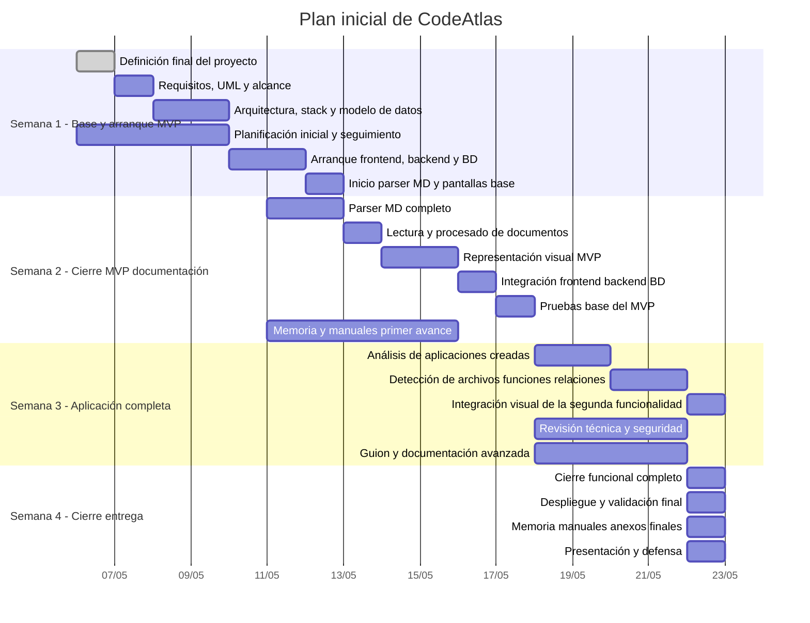

# Gantt inicial de CodeAtlas

Este diagrama traduce la planificación inicial a un formato visual editable en Markdown con Mermaid.

## Nota

Si hace falta, este mismo contenido se puede pasar después a:

- un Gantt más detallado
- una tabla CSV para importarla en otra herramienta
- Trello, Notion, ProjectLibre o similar
