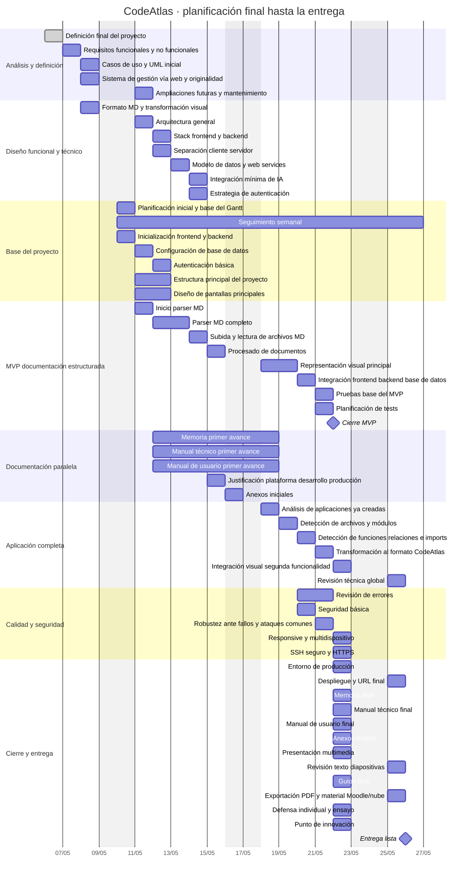

# Gantt final de CodeAtlas

Versión refinada del plan de trabajo para la entrega del proyecto.

## Observaciones

- El MVP se cierra primero, pero el objetivo sigue siendo llegar con la aplicación completa.
- La documentación no se deja solo para el final, sino que avanza en paralelo.
- El cierre del 22 de mayo concentra despliegue, revisión final, documentación final y defensa.
